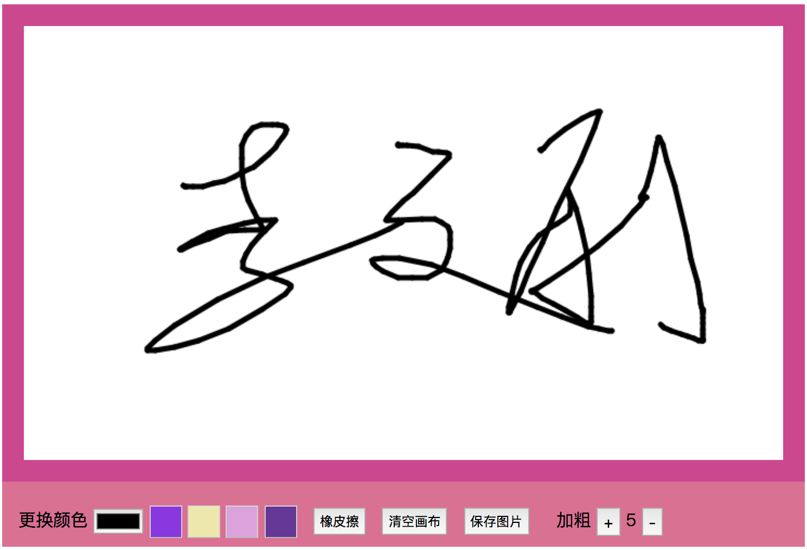

# 开启Canvas之旅 - 基础篇

## 致懂得努力的我们

夫君子之行，静以修身，俭以养德。非淡泊无以明志，非宁静无以致远。夫学须静也，才须学也，非学无以广才，非志无以成学。

淫慢则不能励精，险躁则不能治性。年与时驰，意与日去，遂成枯落，多不接世，悲守穷庐，将复何及！

## Canvas简述
Canvas 是HTML5新增的元素，让我们通过JavaScript脚本来绘制图像, 可以用JavaScript在上面绘制各种图表、动画等。

基于Canvas的一些库：
  - chartjs（图表）
    https://www.chartjs.org/

  - Konva
    https://www.konvajs.com/docs/

  - EaselJS
    http://www.createjs.cc/easeljs/

## Canvas基本用法

创建一个画布
```
<canvas id="canvas" width="300" height="300">
  <p>你的浏览器不支持Canvas</p>
</canvas>
```
如果你的浏览器不支持canvas标签，则标签内的文字会被显示出来

> canvas跟img元素很相像，唯一不同的是它没有src和alt属性，canvas标签（除了选择器）只有width和height两个属性，canvas 如果不设置宽高，默认 300*150。

获取渲染上下文

```
var canvas = document.querySelector('#canvas')

// 获取2D画布的渲染上下文
var ctx = canvas.getContext('2d')
```

context.getContext() 获取渲染上下文，该对象提供了用于在画布上绘图的方法和属性

>提示：在未来，如果 canvas 标签扩展到支持 3D 绘图，getContext() 方法可能允许传递一个 "3d" 字符串参数。

```
console.log(ctx) // 2D渲染上下文对象
```


## 从画一条直线开始

### JS

```
// 通过canvas元素设置宽高
canvas.width = 400
canvas.height = 400

// 设置线条宽度
ctx.lineWidth = 10

// 设置画笔开始绘制坐标（落笔点）
ctx.moveTo(100, 100)
// 连接点
ctx.lineTo(300, 300)

// 设置绘制颜色
ctx.strokeStyle = 'red'
// 根据moveTo和lineTo定制的路径 进行绘制
ctx.stroke()
```

### 页面效果


### 绘制路径
canvas绘图是基于路径的，肉眼看不到，先进行路径绘制 然后再通过 fill（填充）或 stroke（描边）等方法进行填充或绘制。

### 涉及api讲解

- lineWidth
  设置当前绘制线条的宽度。默认值：1像素

- moveTo(x, y)
  相当于画笔落笔点 开始一条路径 相对于画布左上角 x轴坐标 y轴坐标

- lineTo(x, y)
  指定连接点坐标，自动和上一个坐标点进行连接 绘制路径 相对于画布左上角 x轴坐标 y轴坐标

- strokeStyle
  设置通过stroke 绘制描边的颜色。默认值：'#000'

- stroke
  根据moveTo和lineTo定制的路径 进行绘制描边

## 绘制几何图形

### 绘制三角形
#### HTML

```
<canvas id="canvas" width="600" height="600"></canvas>
```

#### JS

```
var canvas = document.querySelector('#canvas')
var ctx = canvas.getContext('2d')

// 设置绘制线条宽度
ctx.lineWidth = 10
// 设置绘制线条颜色
ctx.strokeStyle = 'red'
// 设置填充颜色
ctx.fillStyle = 'pink'

// 开始一条全新的绘制路径
ctx.beginPath()

// 制定路径
ctx.moveTo(300, 50)
ctx.lineTo(550, 500)
ctx.lineTo(50, 500)

// 闭合路径
ctx.closePath()
// 进行填充
ctx.fill()
// 进行绘制
ctx.stroke()
```

#### 页面效果


#### 涉及api
- fillStyle
  设置填充色 默认值：#000

- fill
  根据fillStyle 对当前路径进行填充

- beginPath
  开始一条全新的绘制路径

- closePath
  闭合当前路径，创建从当前点到开始点的路径

#### 路径相关方法讲解

1.beginPath
开始一个全新绘制的路径

假如我要绘制两条颜色不同的平行线条

HTML
```
<canvas id="canvas" width="600" height="600"></canvas>
```

JS

```
var canvas = document.querySelector('#canvas')
var ctx = canvas.getContext('2d')

ctx.moveTo(100, 100)
ctx.lineTo(500, 100)
ctx.strokeStyle = 'yellow'
ctx.stroke()

ctx.moveTo(100, 200)
ctx.lineTo(500, 200)
ctx.strokeStyle = 'red'
ctx.stroke()

ctx.moveTo(100, 300)
ctx.lineTo(500, 300)
ctx.strokeStyle = 'blue'
ctx.stroke()
```

不加beginPath情况下，后面stroke 会从最初路径开是坐标重新绘制一遍 导致之前路径描边颜色发生叠加


在每一次moveTo之前 加上beginPath方法 开始一个全新路径

JS

```
// 通常习惯在第一次的时候也加上beginPath 让代码看上去一致
ctx.beginPath()
ctx.moveTo(100, 100)
ctx.lineTo(500, 100)
ctx.strokeStyle = 'yellow'
ctx.stroke()

ctx.beginPath()
ctx.moveTo(100, 200)
ctx.lineTo(500, 200)
ctx.strokeStyle = 'red'
ctx.stroke()

ctx.beginPath()
ctx.moveTo(100, 300)
ctx.lineTo(500, 300)
ctx.strokeStyle = 'blue'
ctx.stroke()
```

添加beginPath后

效果如下：


2.closePath

假如我们绘制一个几何图形如上，closePath会创建从当前结束点到开始点的路径 形成闭合路径

JS

```
ctx.lineWidth = 10
ctx.strokeStyle = 'red'
ctx.fillStyle = 'pink'

ctx.beginPath()

ctx.moveTo(300, 50)
ctx.lineTo(550, 500)
ctx.lineTo(50, 500)

ctx.fill()
ctx.stroke()
```

不加closePath时 是这样


添加上closePath

JS

```
ctx.lineWidth = 10
ctx.strokeStyle = 'red'
ctx.fillStyle = 'pink'

ctx.beginPath()

ctx.moveTo(300, 50)
ctx.lineTo(550, 500)
ctx.lineTo(50, 500)

// 闭合路径
ctx.closePath()

ctx.fill()
ctx.stroke()
```

添加closePath

效果如下：


例子：

JS

```
ctx.lineWidth = 10
ctx.strokeStyle = 'red'

ctx.beginPath()
ctx.moveTo(300, 100)
ctx.lineTo(500, 500)

ctx.lineTo(300, 500)
ctx.closePath()

ctx.lineTo(100, 500)
ctx.stroke()
```

效果如下：


### 绘制矩形

#### rect(x, y, width, height)
创建一个矩形，需要通过stroke() 进行绘制

JS

```
var canvas = document.querySelector('canvas')
var ctx = canvas.getContext('2d')

ctx.beginPath()
ctx.rect(100, 100, 300, 300)
ctx.stroke()
```

效果如下：


#### strokeRect(x, y, width, height)
根据strokeStyle指定颜色进行矩形描边，绘制无填充色的矩形。
同 rect+stroke 一样效果

JS

```
var canvas = document.querySelector('canvas')
var ctx = canvas.getContext('2d')

ctx.beginPath()
ctx.lineWidth = 10
ctx.strokeStyle = 'red'
ctx.rect(100, 100, 300, 300)
ctx.stroke()
```

效果如下：


#### fillRect(x, y, width, height)
绘制具有填充色的矩形

JS

```
var canvas = document.querySelector('#canvas')
var ctx = canvas.getContext('2d')

ctx.beginPath()
ctx.fillStyle = 'blue'
ctx.fillRect(100, 100, 300, 300)
```

效果如下：


#### 完整绘制一个矩形

JS

```
var canvas = document.querySelector('#canvas')
var ctx = canvas.getContext('2d')

ctx.lineWidth = 10
ctx.fillStyle = 'blue'
ctx.strokeStyle = 'red'

// 方式一
ctx.fillRect(100, 100, 200, 200)
ctx.strokeRect(100, 100, 200, 200)

// 方式二
ctx.rect(320, 100, 200, 200)
ctx.fill()
ctx.stroke()
```


#### 绘制带阴影矩形

JS

```
var canvas = document.querySelector('#canvas')
var ctx = canvas.getContext('2d')

// 阴影模糊度
ctx.shadowBlur = 20
// 阴影颜色
ctx.shadowColor = 'black'

// 绘制带蓝色填充色的矩形
ctx.fillStyle = 'blue'
ctx.fillRect(100, 100, 200, 200)
```


### 线条相关属性

#### lineCap
设置线条两端线帽的样式 context.lineCap=“butt|round|square”;


注意："round" 和 "square" 值会使线条略微变长。

JS

```
var canvas = document.querySelector('#canvas')
var ctx = canvas.getContext('2d')

ctx.lineWidth = 20
ctx.beginPath()
ctx.moveTo(100, 100)
ctx.lineTo(500, 100)
// 默认值
ctx.lineCap = 'butt'
ctx.stroke()

ctx.beginPath()
ctx.moveTo(100, 200)
ctx.lineTo(500, 200)
// 两末端圆形线帽
ctx.lineCap = 'round'
ctx.stroke()

ctx.beginPath()
ctx.moveTo(100, 300)
ctx.lineTo(500, 300)
// 两末端方形线帽
ctx.lineCap = 'square'
ctx.stroke()
```

效果如下：


### 绘制圆形

#### arc

JavaScript 语法：

```
context.arc(x,y,r,sAngle,eAngle,counterclockwise);
```

参数


JS

```
var canvas = document.querySelector('#canvas')
var ctx = canvas.getContext('2d')

ctx.lineWidth = 10
ctx.beginPath()

ctx.arc(300, 300, 100, 0, Math.PI * 2, false)

ctx.strokeStyle = 'blue'
ctx.fillStyle = 'red'
ctx.fill()
ctx.stroke()
```

效果如下：


开始角与结束角


#### 绘制半圆

JS

```
var canvas = document.querySelector('#canvas')
var ctx = canvas.getContext('2d')

ctx.lineWidth = 10
ctx.beginPath()

// 逆时针绘制
ctx.arc(300, 300, 100, 0.5 * Math.PI, 1.5 * Math.PI, true)

ctx.strokeStyle = 'green'
ctx.fillStyle = 'red'
ctx.fill()
ctx.stroke()
```

效果如下：


### 绘制五角星

JS

```
var canvas = document.querySelector('#canvas')
var ctx = canvas.getContext('2d')


// 计算x轴坐标值
// X = Math.cos(弧度) * 半径 + 圆心x轴坐标
var cx = function(i, r, x, d) {
  return Math.cos((d + i * 72) / 180 * Math.PI) * r + x
}

// 计算y轴坐标值
// Y = Math.sin(弧度) * 半径 + 圆心y轴坐标
var sy = function (i, r, y, d) {
  return -Math.sin((d + i * 72) / 180 * Math.PI) * r + y
}

/**
 * @desc 绘制五角星
 * @param  {Object} ctx  2d渲染上下文
 * @param  {Number} r  内圆半径
 * @param  {Number} R  外圆半径
 * @param  {Number} x  圆心x轴位置
 * @param  {Number} y  圆心y轴位置
 * @param  {Color} fillColor  填充色
 * @param  {Color} strokeColor  描边色
 *
 */
function drawStart(ctx, r, R, x, y, fillColor, strokeColor) {
  ctx.fillStyle = fillColor
  ctx.strokeStyle = strokeColor

  ctx.beginPath()
  // 绘制五个角
  for (var i = 0; i < 5; i++) {
    // 绘制外圆路径
    ctx.lineTo( cx(i, R, x, 18), sy(i, R, y, 18))
    // 绘制内圆路径
    ctx.lineTo( cx(i, r, x, 54), sy(i, r, y, 54))
  }
  ctx.closePath()
  ctx.fill()
  ctx.stroke()
}
drawStart(ctx, 100, 200, 300, 300, 'red', 'white')
```

效果如下：


#### 五角星数学知识补下


```
// 求弧度
// 为L = n（圆心角度数）× π × r（半径）/180（角度制）

// 对边与斜边的比叫做正弦（sine），记作sin
// 邻边与斜边的比叫做余弦（cosine），记作cos
// 对边与邻边的比叫做正切（tangent），记作tan

// JS Math.sin() 与 Math.cos() 用法
// Math.sin(x) x 的正玄值。返回值在 -1.0 到 1.0 之间
// Math.cos(x) x 的余弦值。返回的是 -1.0 到 1.0 之间的数
// 这两个函数中的X 都是指的“弧度”而非“角度”，

// 弧度的计算公式为：2 * PI / 360 * 角度
// 30° 角度 的弧度 = 2 * PI / 360 * 30

// 如何得到圆上每个点的坐标？
// 在圆的坐标系中 半径r为斜边 x轴为邻边 y轴为对边
// 正弦 = y / r
// 余弦 = x / r

// 解决思路：根据三角形的正弦、余弦来得值
// 假设一个圆的圆心坐标是(a, b)，半径为r

// X = 圆心x轴坐标 + 弧度的余弦值 * 半径
// 则圆上每个点的X坐标= a + Math.cos(2 * Math.PI / 360) * r

// Y = 圆心y轴坐标 + 弧度的正弦值 * 半径
// Y坐标 = b + Math.cos(2 * Math.PI / 360) * r

// 计算x轴坐标值
// X = Math.cos(弧度) * 半径 + 圆心x轴坐标
var cx = function(i, r, x, d) {
  return Math.cos((d + i * 72) / 180 * Math.PI) * r + x
}

// 计算y轴坐标值
// Y = Math.sin(弧度) * 半径 + 圆心y轴坐标
var sy = function (i, r, y, d) {
  return -Math.sin((d + i * 72) / 180 * Math.PI) * r + y
}

ctx.lineTo(X, Y)
```


## 2018.12.12 我将带大家实现你画我猜的画板（绘画 橡皮擦 图片生成 本地保存 画笔切换）




## 掘金文章地址
https://juejin.im/post/5c0f6fe16fb9a049e12a0d6a

公开课时间：
12月12日 晚上 20：00~21：30

在线地址:
https://ke.qq.com/course/58689

教室地址:
北京昌平区回龙观东大街地铁A口出，向西走100米（紧邻同仁堂）二楼201教室

## 获取更多学习资源

 
 
